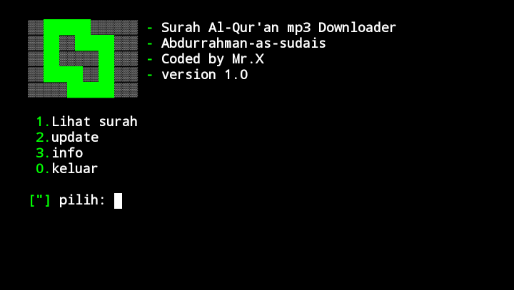

# Surah alquran mp3


Surah alquran mp3 downloader

## Instalations
```
$ pkg update && pkg upgrade
$ pkg install python2 git
$ pip2 install bs4 requests tqdm 
$ git clone https://github.com/Whomrx666/surah-alquran-mp3
$ cd surah-alquran-mp3
$ python2 surah-alquran-mp3.py

```
# To move MP3s to memory
```
$ mv (surah name) /sdcard

```

# Preview several surah in the tools


## Instructions
- **Lihat surah**: To see the list of surahs in the tools
- **Update**: To update tools
- **Info**: To view information about author tools
- **Keluar**: To exit tools
### Original Author
<a href="https://github.com/Whomrx666"></a>

Follow me: [Whatsapp](https://wa.me/6287855190571),[Youtube](https://youtube.com/@whomrx666),[Tiktok](https://www.tiktok.com/@whomr.x),[Telegram](https://www.tiktok.com/@whomr.x),[Telegram](https://t.me/@Whomr_X),&[Website](https://whomrxhackers.blogspot.com/)